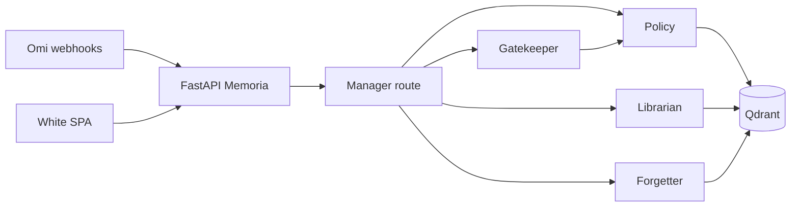

# Memoria

Memoria listens through Omi, decides what it is allowed to store, stores scoped objects in Qdrant, and lets you query, share, complete, or forget them by voice. Judgment runs through Lyzr agents (or an OpenAI JSON fallback with the same prompts when agent IDs are unset). This server owns Qdrant — it does not use Lyzr Studio as the memory source of truth.

## Why Omi, Lyzr, and Qdrant are all load-bearing

- **Omi** supplies real-time transcript and memory webhook events; Memoria returns HTTP 200 immediately and processes asynchronously.
- **Lyzr** runs Gatekeeper, Policy, Librarian, Forgetter, Registrar, and Analyst prompts; when IDs are missing, the API still judges via OpenAI JSON mode and shows **Lyzr: fallback** in the UI.
- **Qdrant** holds scoped memories, commitments, receipts, and traces; forget is `delete` + `count`, never a pretend prompt.



## Setup

```bash
cd memoria
python3.11 -m venv .venv
source .venv/bin/activate
pip install -e ".[dev]"
cp .env.example .env
# Optional local Qdrant:
docker compose up -d
uvicorn apps.api.main:app --reload --host 0.0.0.0 --port 8000
```

Open [http://localhost:8000](http://localhost:8000).

### Environment

See `.env.example` for Qdrant Cloud URL/key, OpenAI embedding key, and Lyzr agent IDs. Set `ALLOWED_UIDS=*` for demos or a comma-separated allowlist for production.

### Omi Integration App

Create an Omi Integration App with:

- **Real-time Transcript** → `POST {APP_PUBLIC_URL}/omi/transcript?uid={user_id}&session_id={session_id}`
- **Memory trigger** → `POST {APP_PUBLIC_URL}/omi/memory?uid={user_id}`

Use the official segment JSON bodies (fixtures under `apps/api/data/fixtures/`).

### Lyzr Studio agents

Create six agents in [Lyzr Studio](https://studio.lyzr.ai) using the system prompts in `apps/api/agents/prompts.py` (temperature 0.1). Paste agent IDs into `.env`. Optional: publish this API’s OpenAPI spec as tools for Librarian / Forgetter / Registrar.

### Qdrant Cloud

Create a cluster, copy HTTPS URL and API key into `QDRANT_URL` and `QDRANT_API_KEY`. Collections `memoria_*` and payload indexes are created on boot.

## Deploy on Render

1. Connect this repository and use **Blueprint** with `memoria/render.yaml`, or create a **Web Service** with root directory `memoria`.
2. Set secret env vars in the Render dashboard (Qdrant, OpenAI, Lyzr).
3. Start command (if not using blueprint):  
   `uvicorn apps.api.main:app --host 0.0.0.0 --port $PORT`  
   with `PYTHONPATH=.` and build `pip install .`.

## Demo script

1. **Seed demo week** on the white dashboard.
2. Send the long preset utterance (Priya / PIN / knee / off the record / Rohan spec).
3. Principal **Me** → Ask *Where did Priya want to eat?* (cited).
4. Ask *What's going on with my knee?* (cited).
5. Switch to **Roommate** — health hidden; home detergent remains.
6. *What do I owe?* → Rohan + Arjun, not Dev.
7. Mark Rohan spec done.
8. *Forget everything about my health* → counts **1 → 0**.
9. Expand **Gold-set matrix** — caption: *The cost function is a leak.*

Mock mode: use the composer and `/dev/utterance` without an Omi device.

## Eval metric

`GET /eval/gate` runs `apps/api/data/gold_set.json` through Gatekeeper + Policy and returns a confusion matrix plus **Never-recall** = TP_never / (TP_never + FN_never).

## Screenshot (expected)

White page, black primary buttons, three cards for live log / commitments / receipts, memory list filtered by principal, Ask panel with monospace citation chips, forget proof showing health count dropping to zero.

## Disclaimer

The dashboard requires **seed data** plus live utterances; audio alone will not populate the demo. Spoken ACL phrases override inferred tier except when content is classified **never** (credentials). Health is **personal** by default, not auto-never.
